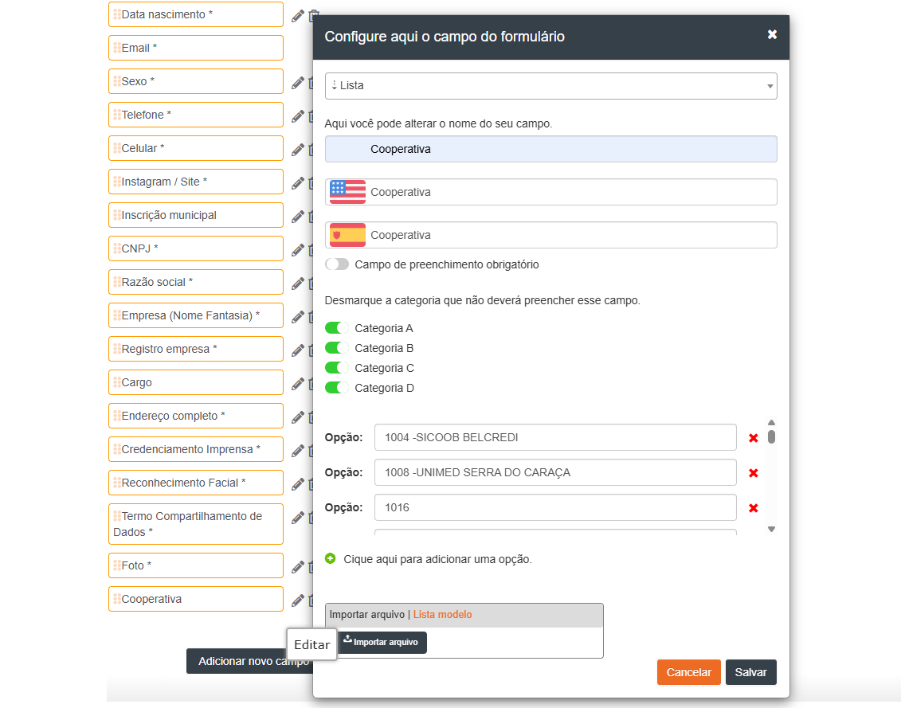
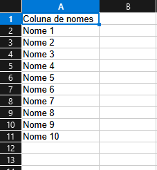
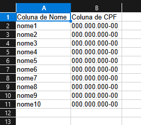
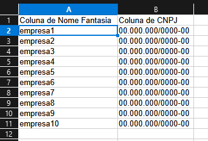
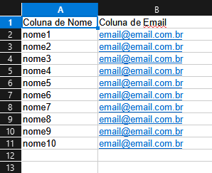

# 📋 Planejamento e Refinamento — Sprint: Tratamento de Caracteres Especiais

**Data de Criação:** 17/03/2026  
**Versão:** 1.0.0  
**Status:** 📝 Em Refinamento  
**Prioridade:** 🔴 Alta  
**Squad:** Desenvolvimento - Online  

---

## 🎯 Objetivo da Demanda

Corrigir e prevenir problemas de importação e processamento de dados no sistema online, causados por caracteres especiais não permitidos que quebram o parsing de planilhas e processamento de campos.

### Problema Identificado

O sistema utiliza separadores específicos (`;`, `_`) para processamento interno de dados. Quando usuários inserem esses caracteres em campos de texto, ocorrem:

- ❌ Quebra na importação de planilhas
- ❌ Falha no parsing de dados
- ❌ Corrupção de registros no banco de dados
- ❌ Erro em processamento de listas e opções

---

## 🚨 Caracteres Proibidos e Níveis de Risco

### Críticos (Quebram o Sistema)

| Caractere | Nome | Motivo | Impacto |
|-----------|------|--------|---------|
| `;` | Ponto e vírgula | Separador de campos no processamento (split) | Sistema não processa corretamente |
| `_` | Underline | Separador de identificador de campo | Quebra identificação de campos |

### Alto Risco

| Caractere | Nome | Motivo | Impacto |
|-----------|------|--------|---------|
| `\|` | Pipe | Pode quebrar processamento ou templates | Erro em exportação/importação |
| `\` | Contra barra | Gera escape inesperado | Corrupção de dados |
| `<` | Menor que | Início de HTML/XSS | Vulnerabilidade de segurança |
| `>` | Maior que | Fechamento de HTML/XSS | Vulnerabilidade de segurança |

### Médio Risco

| Caractere | Nome | Motivo | Impacto |
|-----------|------|--------|---------|
| `"` | Aspas duplas | Quebra atributos HTML | Erro em renderização |
| `'` | Aspas simples | Quebra atributos HTML | Erro em renderização |
| `` ` `` | Crase | Template literal JS | Possível execução de código |

### Baixo Risco

| Caractere | Nome | Motivo | Impacto |
|-----------|------|--------|---------|
| `=` | Igual | Atribuição/manipulação de atributos | Comportamento inesperado |

---

## 📝 Campos que Necessitam Validação

### 1️⃣ Formulário de Inscrição — Criação e Edição

#### 1.1 Campos Multilíngue (Todos os Tipos de Campo)

**Campos a validar:**
- ✅ Nome campo BR (Português)
- ✅ Nome campo EN (Inglês)
- ✅ Nome campo ES (Espanhol)

**Aplicação:** 
- Validação em tempo real durante digitação
- Sanitização antes de salvar no banco
- Validação no backend antes de processar

**Exemplo de implementação:**
```javascript
// No frontend - validação em tempo real
const validador = new BibliotecaValidacaoFormulario();

// Aplicar bloqueio direto ao input
validador.aplicarBloqueioInput(document.getElementById('nomeCampoBR'));
validador.aplicarBloqueioInput(document.getElementById('nomeCampoEN'));
validador.aplicarBloqueioInput(document.getElementById('nomeCampoES'));
```

---

#### 1.2 Opções de Campos — Tipos Lista, Múltipla Escolha e Vários Valores

**Campos a validar:**
- ✅ Nome das opções (BR)
- ✅ Nome das opções (EN)
- ✅ Nome das opções (ES)

**Cenários:**

##### 📌 Cenário 1: Digitação Manual
- Aplicar validação em tempo real
- Bloquear caracteres não permitidos durante digitação
- Exibir mensagem informativa ao usuário

##### 📌 Cenário 2: Importação de Planilha
- **IMPORTANTE:** Não bloquear a importação
- Processar e sanitizar os dados automaticamente
- Remover caracteres proibidos durante o processamento
- Gerar relatório de campos sanitizados
- Notificar usuário sobre alterações realizadas

**Exemplo de implementação para importação:**
```javascript
// Processamento de lote de opções importadas
const validador = new BibliotecaValidacaoFormulario();

function processarImportacaoOpcoes(listaOpcoes) {
    const resultado = validador.validarLote(listaOpcoes);
    
    // Sanitizar automaticamente opções inválidas
    const opcoesSanitizadas = listaOpcoes.map(opcao => {
        return validador.sanitizarCampo(opcao);
    });
    
    // Gerar relatório
    if (resultado.resumo.invalidos > 0) {
        console.log(`⚠️ ${resultado.resumo.invalidos} opções foram sanitizadas`);
        // Exibir notificação ao usuário
    }
    
    return opcoesSanitizadas;
}
```

---

#### 1.3 Campo Tipo Termo (Textarea)

**Campo:** Descrição/Termo

**Particularidades:**
- Já existe texto informativo indicando que não pode conter underline
- **AÇÃO:** Incluir validação ativa além do texto informativo
- Aplicar validação para TODOS os caracteres proibidos (não apenas underline)
- Bloquear digitação de caracteres proibidos em tempo real

**Exemplo de implementação:**
```javascript
// Campo Termo com validação
const validador = new BibliotecaValidacaoFormulario();

const campoTermo = document.getElementById('campoTermo');
validador.aplicarBloqueioInput(campoTermo);

// Validação adicional no envio do formulário
campoTermo.addEventListener('blur', function() {
    const resultado = validador.validarCampo(this.value);
    
    if (!resultado.valido) {
        // Exibir alerta detalhado
        alert(`Campo contém caracteres não permitidos: 
        ${resultado.problemas.map(p => p.valor).join(', ')}`);
        this.focus();
    }
});
```

---

### 2️⃣ Cadastro de Categoria

#### 2.1 Nome da Categoria

**Campos a validar:**
- ✅ Categoria Nova Excel (BR)
- ✅ Categoria Nova Excel (EN)
- ✅ Categoria Nova Excel (ES)

**Aplicação:**
- Validação em tempo real durante digitação
- Bloqueio de caracteres especiais
- Validação no backend antes de salvar

**Exemplo de implementação:**
```javascript
// Tela de cadastro de categoria
const validador = new BibliotecaValidacaoFormulario();

// Validar nome da categoria em todos os idiomas
document.querySelectorAll('.nome-categoria').forEach(input => {
    validador.aplicarBloqueioInput(input);
});
```

#### 2.2 Campo Descrição da Categoria

**Campo:** Descrição (textarea multilíngue)

**Aplicação:**
- Mesma validação aplicada aos nomes
- Permite texto livre, mas sem caracteres proibidos
- Validação em tempo real

---

#### 2.3 Importação de Lista de Pessoas

**Cenário:** Quando categoria está vinculada a uma lista de pessoas

**Ação necessária:**
- Validar campos de texto da planilha importada:
  - ✅ Nome
  - ✅ CPF (formato garantido, mas validar caracteres extras)
  - ✅ CNPJ (formato garantido, mas validar caracteres extras)
  - ✅ Outros campos personalizados

**Comportamento esperado:**
- Sanitizar automaticamente campos com caracteres proibidos
- Não bloquear importação
- Gerar relatório de sanitização
- Notificar usuário sobre alterações

**Exemplo de implementação:**
```javascript
// Processamento de importação de lista de pessoas
function processarImportacaoListaPessoas(arquivoExcel) {
    const validador = new BibliotecaValidacaoFormulario();
    const dados = lerPlanilhaExcel(arquivoExcel);
    
    const relatorioSanitizacao = [];
    
    // Processar cada linha
    dados.forEach((linha, index) => {
        // Validar campo Nome
        if (linha.nome) {
            const original = linha.nome;
            linha.nome = validador.sanitizarCampo(linha.nome);
            
            if (original !== linha.nome) {
                relatorioSanitizacao.push({
                    linha: index + 1,
                    campo: 'Nome',
                    original: original,
                    sanitizado: linha.nome
                });
            }
        }
        
        // Validar outros campos de texto...
    });
    
    // Exibir relatório ao usuário
    if (relatorioSanitizacao.length > 0) {
        exibirRelatorioSanitizacao(relatorioSanitizacao);
    }
    
    return dados;
}
```

---

### 3️⃣ Cadastro de Atividade

**Status atual:** Nome da atividade já possui tratamento

**Ação:** 
- ✅ Verificar se validação atual está alinhada com a biblioteca
- ✅ Garantir que todos os caracteres proibidos estão sendo tratados
- ✅ Manter consistência com outros campos do sistema

---

## 🛠️ Implementação da Biblioteca de Validação

### Instalação e Configuração

**1. Incluir a biblioteca no projeto:**

```html
<!-- Incluir no HTML -->
<script src="/js/BibliotecaValidacaoFormulario.js"></script>
```

**2. Inicializar a biblioteca:**

```javascript
// Criar instância com configurações
const validador = new BibliotecaValidacaoFormulario({
    logVerbose: true,        // Ativar logs detalhados (desenvolvimento)
    logPrefix: '📝 [Validação]',
    logColors: true          // Logs coloridos no console
});

// Para produção, desativar logs verbosos:
const validador = new BibliotecaValidacaoFormulario({
    logVerbose: false
});
```

---

### 📸 Exemplos de Uso da Biblioteca

#### Exemplo 1: Validação Simples de Campo

```javascript
const validador = new BibliotecaValidacaoFormulario();

// Validar um campo
const resultado = validador.validarCampo('Categoria_Nova');

console.log(resultado);
/* Saída:
{
  valido: false,
  riscoGeral: 'critico',
  problemas: [
    {
      tipo: 'caractere_proibido',
      valor: '_',
      posicao: 9,
      risco: 'critico',
      descricao: 'Separador de identificador de campo'
    }
  ],
  tempoValidacao: 2
}
*/
```

---

#### Exemplo 2: Sanitização de Campo

```javascript
const validador = new BibliotecaValidacaoFormulario();

// Texto com caracteres proibidos
const textoOriginal = 'Categoria_Nova; com <script>';

// Sanitizar (remover caracteres proibidos)
const textoLimpo = validador.sanitizarCampo(textoOriginal);

console.log(textoLimpo);
// Saída: 'Categoria Nova com script'
```

---

#### Exemplo 3: Bloqueio em Input HTML (Tempo Real)

```html
<!-- HTML -->
<label>Nome da Categoria (BR):</label>
<input type="text" id="categoriaBR" class="form-control">

<label>Nome da Categoria (EN):</label>
<input type="text" id="categoriaEN" class="form-control">

<label>Nome da Categoria (ES):</label>
<input type="text" id="categoriaES" class="form-control">
```

```javascript
// JavaScript
const validador = new BibliotecaValidacaoFormulario();

// Aplicar bloqueio automático
validador.aplicarBloqueioInput(document.getElementById('categoriaBR'));
validador.aplicarBloqueioInput(document.getElementById('categoriaEN'));
validador.aplicarBloqueioInput(document.getElementById('categoriaES'));

// Agora, ao digitar caracteres proibidos, eles são removidos automaticamente!
```

---

#### Exemplo 4: Validação em Lote (Importação)

```javascript
const validador = new BibliotecaValidacaoFormulario();

// Lista de opções importadas de uma planilha
const opcoesImportadas = [
    'Arquivo_Verde',
    'Capitão; América',
    'DeadPool',
    'Homem|Aranha',
    'Thor'
];

// Validar todas de uma vez
const resultado = validador.validarLote(opcoesImportadas);

console.log(resultado.resumo);
/* Saída:
{
  total: 5,
  validos: 2,    // DeadPool, Thor
  invalidos: 3,  // Arquivo_Verde, Capitão; América, Homem|Aranha
  tempoTotal: 5
}
*/

// Processar resultados individuais
resultado.resultados.forEach((res, index) => {
    if (!res.valido) {
        console.log(`Opção "${opcoesImportadas[index]}" possui problemas:`);
        res.problemas.forEach(p => {
            console.log(`- Caractere "${p.valor}" não permitido (${p.descricao})`);
        });
    }
});
```

---

#### Exemplo 5: Validação Completa com Feedback ao Usuário

```javascript
// Função completa para validar campo com feedback visual
function validarCampoComFeedback(inputElement) {
    const validador = new BibliotecaValidacaoFormulario();
    const valor = inputElement.value;
    
    // Validar
    const resultado = validador.validarCampo(valor);
    
    // Remover classes anteriores
    inputElement.classList.remove('is-valid', 'is-invalid');
    
    // Container para mensagem
    let feedback = inputElement.nextElementSibling;
    if (!feedback || !feedback.classList.contains('feedback-message')) {
        feedback = document.createElement('div');
        feedback.classList.add('feedback-message');
        inputElement.parentNode.insertBefore(feedback, inputElement.nextSibling);
    }
    
    if (resultado.valido) {
        // Campo válido
        inputElement.classList.add('is-valid');
        feedback.innerHTML = '<span class="text-success">✓ Campo válido</span>';
        feedback.style.display = 'block';
    } else {
        // Campo inválido
        inputElement.classList.add('is-invalid');
        
        const mensagens = resultado.problemas.map(p => 
            `<li>Caractere "${p.valor}" não permitido — ${p.descricao}</li>`
        ).join('');
        
        feedback.innerHTML = `
            <div class="alert alert-danger">
                <strong>⚠️ Caracteres não permitidos encontrados:</strong>
                <ul>${mensagens}</ul>
            </div>
        `;
        feedback.style.display = 'block';
    }
    
    return resultado.valido;
}

// Aplicar validação em evento blur
document.querySelectorAll('.campo-validar').forEach(input => {
    input.addEventListener('blur', function() {
        validarCampoComFeedback(this);
    });
});
```

---

## 📊 Regex de Caracteres Permitidos

A biblioteca utiliza a seguinte expressão regular para validar caracteres permitidos:

```javascript
/^[a-zA-ZÀ-ÿ0-9\s,.!?:\-()/@#&+]*$/
```

**Permitidos:**
- ✅ Letras: `a-z`, `A-Z`, `À-ÿ` (acentuação)
- ✅ Números: `0-9`
- ✅ Espaços
- ✅ Pontuação básica: `,`, `.`, `!`, `?`, `:`
- ✅ Símbolos específicos: `-`, `(`, `)`, `/`, `@`, `#`, `&`, `+`

**Proibidos (parcial):**
- ❌ `;` (ponto e vírgula)
- ❌ `_` (underline)
- ❌ `|` (pipe)
- ❌ `\` (contra barra)
- ❌ `<`, `>` (tags HTML)
- ❌ `"`, `'`, `` ` `` (aspas)
- ❌ `=` (igual)

---

## 🎬 Plano de Implementação por Etapas

### Fase 1: Formulário de Inscrição 🔵

**Prioridade:** Alta  
**Estimativa:** 8 pontos  
**Responsável:** Squad Front-end + Back-end

**Tarefas:**
- [ ] Incluir biblioteca no projeto
- [ ] Aplicar validação nos campos multilíngue (BR, EN, ES)
- [ ] Implementar bloqueio em tempo real em campos Nome
- [ ] Validar campos tipo Lista, Múltipla Escolha e Vários Valores
- [ ] Implementar sanitização automática na importação de planilhas
- [ ] Adicionar validação completa no campo Termo
- [ ] Criar testes unitários para validação
- [ ] Documentar implementação

**Critérios de Aceite:**
- ✅ Usuário não consegue digitar caracteres proibidos em campos de nome
- ✅ Importação de planilha sanitiza automaticamente caracteres proibidos
- ✅ Sistema gera relatório de campos sanitizados
- ✅ Campo Termo valida todos os caracteres proibidos (não apenas underline)
- ✅ Mensagens de erro são claras e informativas

---

### Fase 2: Cadastro de Categoria 🟢

**Prioridade:** Alta  
**Estimativa:** 5 pontos  
**Responsável:** Squad Front-end + Back-end

**Tarefas:**
- [ ] Aplicar validação em Nome da Categoria (3 idiomas)
- [ ] Validar campo Descrição da Categoria
- [ ] Implementar validação em importação de lista de pessoas
- [ ] Criar relatório de sanitização para importação
- [ ] Adicionar notificação visual ao usuário sobre sanitização
- [ ] Criar testes de integração
- [ ] Atualizar documentação do usuário

**Critérios de Aceite:**
- ✅ Nome da categoria não aceita caracteres proibidos
- ✅ Importação de lista sanitiza campos automaticamente
- ✅ Relatório detalhado é exibido ao usuário após importação
- ✅ Usuário é notificado sobre alterações realizadas
- ✅ Dados sanitizados são salvos corretamente no banco

---

### Fase 3: Verificação de Atividade 🟡

**Prioridade:** Média  
**Estimativa:** 2 pontos  
**Responsável:** Squad Back-end

**Tarefas:**
- [ ] Auditar validação atual do nome da atividade
- [ ] Garantir alinhamento com biblioteca
- [ ] Atualizar se necessário
- [ ] Documentar padrão utilizado

**Critérios de Aceite:**
- ✅ Validação de atividade está alinhada com a biblioteca
- ✅ Todos os caracteres proibidos são tratados
- ✅ Documentação atualizada

---

### Fase 4: Validação Backend 🔴

**Prioridade:** Crítica  
**Estimativa:** 5 pontos  
**Responsável:** Squad Back-end

**Tarefas:**
- [ ] Implementar validação no backend (camada de segurança)
- [ ] Adicionar sanitização antes de salvar no banco
- [ ] Criar middleware de validação
- [ ] Implementar logs de tentativas de caracteres proibidos
- [ ] Criar testes de segurança
- [ ] Documentar API

**Critérios de Aceite:**
- ✅ Backend valida todos os campos antes de salvar
- ✅ Dados inválidos são rejeitados com mensagem clara
- ✅ Logs registram tentativas de inserção de caracteres proibidos
- ✅ API retorna erros padronizados
- ✅ Testes de segurança passam com 100% de cobertura

---

## 🧪 Casos de Teste

### Teste 1: Campo Nome (Português)
```
Entrada: "Categoria_Nova"
Esperado: Rejeitado
Motivo: Contém underline
```

### Teste 2: Campo Nome (Inglês)
```
Entrada: "New; Category"
Esperado: Rejeitado
Motivo: Contém ponto e vírgula
```

### Teste 3: Campo Nome (Espanhol)
```
Entrada: "Nueva Categoría"
Esperado: Aceito
Motivo: Apenas caracteres permitidos (acentuação permitida)
```

### Teste 4: Sanitização de Importação
```
Entrada: ["Opção_1", "Opção;2", "Opção|3"]
Esperado: ["Opção 1", "Opção 2", "Opção 3"]
Motivo: Caracteres proibidos removidos automaticamente
```

### Teste 5: Campo Termo
```
Entrada: "Aceito os termos <script>alert('xss')</script>"
Esperado: Rejeitado
Motivo: Contém tags HTML (possível XSS)
```

### Teste 6: Lista de Pessoas (Importação)
```
Nome: "João_Silva; CPF: 123.456.789-00"
Esperado: "João Silva CPF 123.456.789-00"
Motivo: Caracteres proibidos removidos, mantendo formato
```

---

## 📈 Métricas de Sucesso

**KPIs para acompanhamento:**

1. **Redução de Erros de Importação**
   - Meta: Reduzir em 95% os erros de importação relacionados a caracteres especiais
   - Baseline atual: X erros/mês
   - Medição: Logs de erro do sistema

2. **Taxa de Sanitização**
   - Meta: < 5% de registros necessitando sanitização após lançamento
   - Medição: Relatórios de sanitização gerados

3. **Tempo de Resposta**
   - Meta: Validação em < 5ms por campo
   - Medição: Performance da biblioteca (já implementado)

4. **Satisfação do Usuário**
   - Meta: < 2 tickets de suporte relacionados a caracteres especiais/mês
   - Baseline atual: Y tickets/mês
   - Medição: Sistema de tickets

---

## 🚀 Cronograma

| Fase | Início | Fim | Status |
|------|--------|-----|--------|
| Fase 1: Formulário de Inscrição | Sprint 1 | Sprint 1 | 🔵 Planejado |
| Fase 2: Cadastro de Categoria | Sprint 1 | Sprint 2 | 🔵 Planejado |
| Fase 3: Verificação de Atividade | Sprint 2 | Sprint 2 | 🔵 Planejado |
| Fase 4: Validação Backend | Sprint 2 | Sprint 3 | 🔵 Planejado |

---

## 🔗 Arquivos de Exemplo

Nesta pasta contém os seguintes arquivos de exemplo para referência:

- 📄 `exemploCnpj.xlsx` — Exemplo de importação com CNPJ
- 📄 `exemploCpf.xlsx` — Exemplo de importação com CPF  
- 📄 `exemploEmail.xlsx` — Exemplo de importação com Email
- 📄 `exemploNome.xlsx` — Exemplo de importação com Nome
- 📄 `exemploOpcoes.xlsx` — Exemplo de importação de opções

**Ação:** Utilizar esses arquivos para testar a sanitização durante importação.

---

## ⚠️ Riscos e Mitigações

### Risco 1: Usuários reclamarem da remoção de caracteres
**Probabilidade:** Média  
**Impacto:** Baixo  
**Mitigação:**
- Comunicar claramente ao usuário quais caracteres foram removidos
- Exibir relatório detalhado após importação
- Criar FAQ explicando os motivos técnicos

### Risco 2: Performance degradada em importações grandes ⚠️ (Precisa avaliar)
**Probabilidade:** Baixa  
**Impacto:** Médio  
**Mitigação:**
- Biblioteca já otimizada (validação < 5ms)
- Processar em batch de 1000 registros
- Implementar loading indicator

### Risco 3: Dados legados já contaminados
**Probabilidade:** Alta  
**Impacto:** Alto  
**Mitigação:**
- Criar script de sanitização de dados legados
- Executar em horário de baixo uso
- Gerar relatório de alterações realizadas
- Backup completo antes da operação

---

## 📚 Referências

- 📘 [Documentação Original](./Referencia.md)
- 💻 [Biblioteca de Validação](./BibliotecaValidacaoFormulario.js)
- 🎨 Screenshots da interface (ver seção "Prints das Telas" abaixo)

---

## 📸 Prints das Telas do Sistema

### Tela 1: Cadastro de Categoria


*Campos "Categoria Nova Excel" em 3 idiomas onde validação será aplicada*

**Campos a validar:**
- Nome da categoria (BR, EN, ES)
- Descrição
- Opções (quando aplicável)

---

### Tela 2: Categoria com Importação de Lista


*Opção de importar arquivo para lista de pessoas vinculada à categoria*

**Validações necessárias:**
- Sanitizar campos do arquivo importado (Nome, CPF, CNPJ)
- Exibir relatório pós-importação
- Notificar usuário sobre alterações

---

### Tela 3: Configuração de Campo do Formulário


*Configuração de campo tipo Lista com opções multilíngue*

**Campos a validar:**
- Nome do campo adicional (BR, EN, ES)
- Nome das opções (manual ou importada)
- Importação de arquivo de opções

**Comportamento esperado:**
- Digitação manual: Bloquear caracteres proibidos em tempo real
- Importação: Sanitizar automaticamente e gerar relatório

---

### Tela 4: Arquivos de Exemplo para Importação


*Arquivos .xlsx utilizados como modelo para importação*

**Arquivos disponíveis:**
- `exemploCnpj.xlsx`
- `exemploCpf.xlsx`
- `exemploEmail.xlsx`
- `exemploNome.xlsx`
- `exemploOpcoes.xlsx`

**Uso:** Utilizar para testes de sanitização durante importação

---

## Problemas conhecidos na importação

### 🐛 Problema 1: Importação de opções contendo `_` (underline)

Ao importar uma lista de opções para um campo de formulário contendo o caractere underline (`_`), o comportamento diverge entre criação e edição.


*Arquivos .xlsx utilizados como modelo para importação*

A lista é importada normalmente, quando é uma criação de um novo campo, porém na edição o texto após
o underline é removido



Este erro ocorre porque na hora da edição o frontend envia uma lista de todas as opções concatenadas em uma string
separadas apenas por underline e ponto e virgula. O Problema é que o underline é utilizado para separa o id da opção após criação
como o usuário enviou uma lista com ids personalizados sepadador por underline, o backend que por sua vez utiliza o underline e 
o ponto e virgula como separadores desta string desconsiderou o restante do texto.

#### 📥 Cenário

Foi realizada a importação de um arquivo `.xlsx` com opções que possuem underline no texto:

> Ex: `opcao_1`, `categoria_teste`, etc.

- ✅ **Na criação de um novo campo:**  
  As opções são importadas corretamente, mantendo o texto completo.

- ❌ **Na edição do campo:**  
  O texto após o underline (`_`) é removido.

#### ⚠️ Causa do problema

Durante a edição, o frontend envia todas as opções em uma única string concatenada, utilizando:

- `;` (ponto e vírgula) como separador entre opções  
- `_` (underline) como separador interno entre **ID da opção** e **texto**

#### Exemplo simplificado do formato enviado:

```text
1_opcao_1;2_categoria_teste;3_item_abc
```

### 🐛 Problema 2: Importação de listas de categoria, não fazem validação se há caracteres não permiditos no nome

Ao importar uma lista de de categoria, seja ela de:

- Nome



- Cpf



- Cnpj



- Email



*Arquivos .xlsx utilizados como modelo para importação*

A lista é importada normalmente, não há uma validação para caracteres não permitidos para a coluna **nome**
Não há validações para verificar se o **cpf** ou o **cnpj** são numeros e nas formatações adequadas.


#### ⚠️ Problemas identificados

##### 🔹 1. Campo Nome
- Não há validação para caracteres inválidos
- Permite inserção de caracteres especiais não permitidos
- Pode causar inconsistência de dados no sistema


##### 🔹 2. Campo CPF
- Não há validação para garantir que o valor seja numérico
- Não há validação de formato (ex: `000.000.000-00`)
- Não há validação de dígitos verificadores

##### 🔹 3. Campo CNPJ
- Não há validação para garantir que o valor seja numérico
- Não há validação de formato (ex: `00.000.000/0000-00`)
- Não há validação de dígitos verificadores
- Avaliar se iremos adotar alguma forma de atender Cnpjs na nova formatação com letras e numeros

##### 🔹 4. Campo Email
- Não há validação de formato (ex: `usuario@dominio.com`)
- Permite valores inválidos que não representam emails reais

### 💥 Impacto

A ausência dessas validações pode resultar em:

- Dados inconsistentes ou inválidos no banco
- Problemas em integrações futuras
- Falhas em processos que dependem de dados válidos (ex: envio de email, validação de CPF/CNPJ)
- Dificuldade de manutenção e confiabilidade do sistema

### 💡 Possíveis soluções (sugestão técnica)

- Implementar validações no backend para cada tipo de dado:
  - Nome: restringir caracteres inválidos
  - CPF/CNPJ: validar formato e dígitos verificadores
  - Email: validar padrão com regex apropriado

- Validar os dados já no momento da importação (fail-fast)

- Retornar mensagens claras ao usuário indicando quais registros estão inválidos

- Opcional: implementar validação também no frontend para melhorar a experiência do usuário

---

## 💡 Exemplo de Mensagens ao Usuário

### Mensagem 1: Campo com Caractere Proibido (Tempo Real)

```
⚠️ Atenção!

O campo contém caracteres não permitidos que podem causar 
problemas de importação:

• Caractere "_" (underline) — Separador de identificador de campo
• Caractere ";" (ponto e vírgula) — Separador de campos no processamento

Por favor, utilize apenas letras, números e pontuação básica.
```

---

### Mensagem 2: Relatório de Sanitização (Pós-Importação)

```
✅ Importação Concluída com Sucesso!

📊 Resumo:
• Total de registros: 150
• Registros processados: 150
• Campos sanitizados: 12

⚠️ Alterações Realizadas:

Linha 5 — Campo "Nome":
  Original: "João_Silva; Gerente"
  Sanitizado: "João Silva Gerente"

Linha 23 — Campo "Nome":
  Original: "Maria|Santos"
  Sanitizado: "Maria Santos"

Linha 47 — Campo "Descrição":
  Original: "Categoria\Especial"
  Sanitizado: "Categoria Especial"

[Ver Relatório Completo] [Continuar]
```

---

### Mensagem 3: Notificação de Sanitização

```
ℹ️ Alguns campos foram ajustados automaticamente

Durante a importação, detectamos caracteres especiais que 
poderiam causar problemas. Esses caracteres foram removidos 
automaticamente para garantir o processamento correto.

12 campos foram ajustados em 150 registros.

[Ver Detalhes] [OK]
```

---

## ✅ Checklist de Implementação

**Preparação:**
- [ ] Biblioteca incluída no projeto
- [ ] Biblioteca testada em ambiente de desenvolvimento
- [ ] Documentação técnica revisada
- [ ] Equipe treinada no uso da biblioteca

**Formulário de Inscrição:**
- [ ] Validação em campos multilíngue (BR, EN, ES)
- [ ] Bloqueio em tempo real implementado
- [ ] Validação de opções (Lista, Múltipla Escolha, Vários Valores)
- [ ] Sanitização em importação de planilhas
- [ ] Campo Termo validado completamente
- [ ] Mensagens de erro configuradas
- [ ] Testes unitários criados

**Cadastro de Categoria:**
- [ ] Validação em Nome da Categoria (3 idiomas)
- [ ] Validação em Descrição
- [ ] Validação em importação de lista de pessoas
- [ ] Relatório de sanitização implementado
- [ ] Notificações ao usuário configuradas
- [ ] Testes de integração criados

**Cadastro de Atividade:**
- [ ] Validação atual auditada
- [ ] Alinhamento com biblioteca verificado
- [ ] Atualizações aplicadas (se necessário)

**Backend:**
- [ ] Validação no backend implementada
- [ ] Middleware de validação criado
- [ ] Sanitização antes de salvar no banco
- [ ] Logs configurados
- [ ] API documentada
- [ ] Testes de segurança criados

**Dados Legados:**
- [ ] Script de sanitização desenvolvido
- [ ] Backup completo realizado
- [ ] Sanitização executada
- [ ] Relatório de alterações gerado
- [ ] Validação pós-sanitização concluída

**Documentação:**
- [ ] Documentação técnica atualizada
- [ ] FAQ criado para usuários
- [ ] Guia de uso da biblioteca documentado
- [ ] Changelog atualizado

**Testes:**
- [ ] Testes unitários (100% de cobertura)
- [ ] Testes de integração
- [ ] Testes de segurança
- [ ] Testes de performance
- [ ] Testes de aceitação do usuário (UAT)

**Deploy:**
- [ ] Code review aprovado
- [ ] Testes em ambiente de homologação
- [ ] Aprovação do PO
- [ ] Deploy em produção
- [ ] Monitoramento pós-deploy

---

## 🤝 Stakeholders

| Nome | Papel | Responsabilidade |
|------|-------|------------------|
| [Nome PO] | Product Owner | Aprovação final e priorização |
| [Nome Tech Lead] | Tech Lead | Arquitetura e revisão técnica |
| [Nome Dev Front] | Dev Front-end | Implementação frontend |
| [Nome Dev Back] | Dev Back-end | Implementação backend e API |
| [Nome QA] | Quality Assurance | Testes e validação |
| [Nome DevOps] | DevOps | Deploy e monitoramento |

---

## 📝 Notas de Refinamento

**Data da Reunião:** [A definir]  
**Participantes:** [A definir]

**Pontos Discutidos:**
- [ ] Definir prioridade entre Fase 1 e Fase 2
- [ ] Avaliar necessidade de sanitização de dados legados
- [ ] Definir estratégia de comunicação com usuários
- [ ] Revisar estimativas de pontos

**Dúvidas Pendentes:**
- [ ] Qual comportamento esperado se importação tiver 100% de linhas com problemas?
- [ ] Deve-se manter histórico de sanitizações realizadas?
- [ ] Notificação por email para importações grandes com muitos ajustes?

**Decisões Tomadas:**
- [A definir]

---

## 📊 Anexos

### Anexo A: Estrutura da Biblioteca

```
BibliotecaValidacaoFormulario/
├── BibliotecaValidacaoFormulario.js
├── Documentacao.md
└── README.md
```

### Anexo B: Compatibilidade

**Navegadores suportados:**
- ✅ Chrome 90+
- ✅ Firefox 88+
- ✅ Safari 14+
- ✅ Edge 90+

**Dependências:**
- Nenhuma (biblioteca standalone)

### Anexo C: Licença

MIT License — Uso livre com manutenção dos créditos

---

**Documento criado em:** 17/03/2026  
**Última atualização:** 17/03/2026  
**Versão:** 1.0.0  
**Próxima revisão:** [A definir após refinamento]

---

## 🎯 Resumo Executivo

Este documento detalha o planejamento completo para implementação de validação e sanitização de caracteres especiais em campos de formulário do sistema online, visando eliminar problemas de importação e processamento de dados.

**Benefícios esperados:**
- ✅ Redução de 95% nos erros de importação
- ✅ Melhoria na qualidade dos dados
- ✅ Prevenção de vulnerabilidades de segurança
- ✅ Melhor experiência do usuário
- ✅ Redução de tickets de suporte

**Esforço estimado:** 20 pontos (2-3 sprints)  
**ROI:** Alto — Redução significativa de retrabalho e suporte

---

